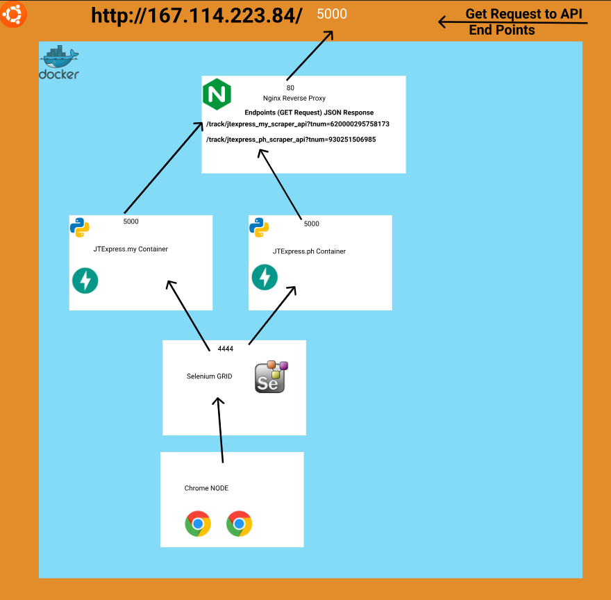

<div align="center">
  <h1>trackscourier_apis</h1>
  <p><h3 align="center">Selenium Based Scraper API and Wordpress Plugin for jtexpress couriers🚀</h3></p>
</div>

[Design Doc](trackscourier.pdf)
&nbsp;&nbsp;•&nbsp;&nbsp;


<hr>



# 🚀 Usage

## Run

```bash
docker-compose  up --build
```


# 📝 Documentation

# 📚 References


# 🤝🏻 Connect with Me

[](https://github.com/HuzaifaIrfan/)
[](https://www.huzaifairfan.com)

# 📜 License

Licensed under the GPL3 License, Copyright 2025 Huzaifa Irfan. [LICENSE](LICENSE)
