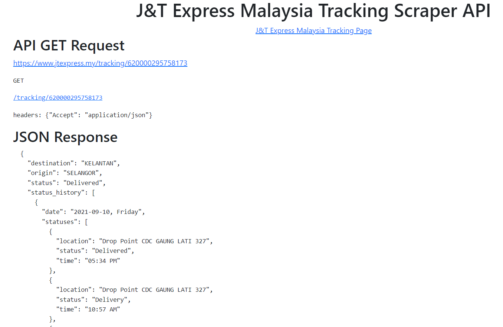
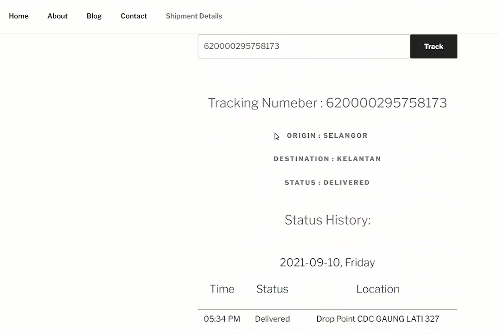

# JTExpress Malaysia Tracking Scraper API and Wordpress Plugin

[JTExpress Malaysia Tracking Page](https://www.jtexpress.my/tracking/)

## API Home

## Wordpress Plugin

### Setup number of Selenium Drivers running per worker in settings.py file

## Install Dependencies
> apt install chromium-chromedriver python3-selenium python3-bs4 python3-flask python3-requests gunicorn

OR

> pip install -r requirements.txt

## Development Server
> python app.py

## API Stress Test
> python test.py

## Production Server 
> gunicorn app:app -w 4 --threads 8 -b 0.0.0.0:5000

## Docker Run
> docker-compose up -d

Developed on Sept 29, 2021

By Huzaifa Irfan

* Website [huzaifairfan.com](http://huzaifairfan.com/)
* Email : [huzaifairfan2001@gmail.com](mailto:huzaifairfan2001@gmail.com)